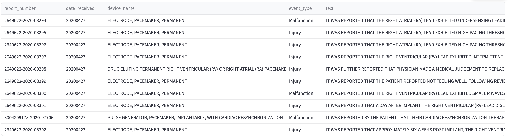
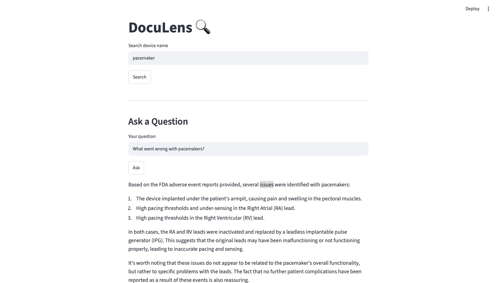
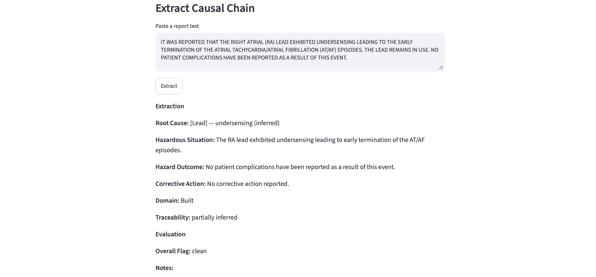

# DocuLens 🔍

> Transforming unstructured reports into structured, queryable data, 
> making the messy documents that power critical business decisions usable.

## What is DocuLens?

DocuLens is an open-source document intelligence pipeline that connects 
to real-world document sources, extracts structured information using LLMs, 
and makes that information searchable, queryable, and useful.

Most important documents in companies, regulatory reports, adverse event 
records, filings, contracts, exist as unstructured text. DocuLens changes that.

## Architecture

DocuLens is built in four layers:

| Layer | What it does | Status |
|-------|-------------|--------|
| 1 — Document Explorer | Connect to public APIs, retrieve documents | Complete |
| 2 — RAG Assistant | Ask natural language questions, get cited answers | Complete |
| 3 — Structured Extraction | Extract validated causal chains, two-pass LLM evaluation | Complete |
| 4 — Agent | ReAct agent that orchestrates search, retrieval, and extraction tools | In Progress |

## Connectors

**Implemented**

- FDA MAUDE — Medical-device adverse-event reports

**Planned**

- Health Canada medical-device reports
- SEC EDGAR financial filings
- Local PDF and DOCX files
- Public web documents

## Quick Start

```bash
git clone https://github.com/TaninEsfandi/document-intelligence-pipeline.git
cd document-intelligence-pipeline
python -m venv .venv
source .venv/bin/activate
pip install -r requirements.txt
```

## Project Structure

```text
document-intelligence-pipeline/
├── app/
│   ├── agent/
│   │   ├── graph.py
│   │   ├── tools.py
│   │   └── evaluator.py
│   ├── connectors/
│   │   └── fda.py
│   ├── report_transformers/
│   │   └── fda_transformers.py
│   ├── models/
│   │   ├── report.py
│   │   ├── extraction.py     
│   │   └── critic.py         
│   ├── rag/
│   │   ├── embedder.py
│   │   ├── vector_store.py
│   │   ├── retriever.py
│   │   ├── runner.py
│   │   ├── extractor.py      
│   │   └── evaluator.py      
│   ├── main.py
│   └── streamlit_app.py
├── configs/
│   └── prompts/
│       ├── extraction_prompt.txt  
│       └── critic_prompt.txt      
```

## Tech Stack

Python · FastAPI · ChromaDB · Pydantic · Streamlit · 
sentence-transformers · Ollama · MLflow · llama3.1:8b · two-pass LLM evaluation · LangGraph

## Agentic Workflow

The LangGraph ReAct agent selects among three tools:

- `search_documents` — answers questions using RAG
- `retrieve_report` — retrieves FDA reports by device
- `extract_structured_fields` — extracts and validates causal-chain fields

Agent evaluation for tool-selection accuracy, groundedness, and latency is currently in progress.

## Demo



